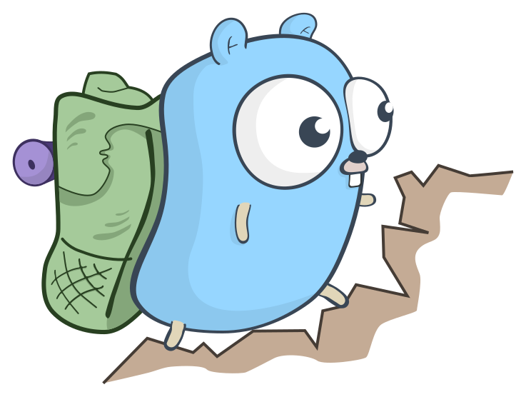

<div align="center">

<picture>
    
</picture>
<br>

<h1>Hann</h1>

[](https://github.com/habedi/hann/actions/workflows/tests.yml)
[](https://github.com/habedi/hann/actions/workflows/lints.yml)
[](https://codecov.io/gh/habedi/hann)
[](https://www.codefactor.io/repository/github/habedi/hann)
[](https://pkg.go.dev/github.com/habedi/hann)
[](LICENSE)
[](https://github.com/habedi/hann/releases/latest)

A fast approximate nearest neighbor search library for Go

</div>

---

Hann is a high-performance approximate nearest neighbor search (ANN) library for Go.
It provides a collection of index data structures for efficient similarity search in high-dimensional spaces.
Currently, supported indexes include Hierarchical Navigable Small World (HNSW),
Product Quantization Inverted File (PQIVF), and Random Projection Tree (RPT).

Hann can be seen as a core component of a vector database (like Milvus, Pinecone, Weaviate, Qdrant, etc.).
It can be used to add fast in-memory similarity search capabilities to your Go applications.

### Features

- Unified interface for different indexes (see [core/index.go](core/index.go))
- Support for indexing and searching vectors of arbitrary dimension
- Fast distance computation using SIMD (AVX) instructions (see [core/simd_distance.c](core/simd_distance.c))
- Support for bulk insertion, deletion, and update of vectors
- Support for saving indexes to disk and loading them back

#### Indexes

| Index Name                                            | Space Complexity | Build Complexity | Search Complexity                             | 
|-------------------------------------------------------|------------------|------------------|-----------------------------------------------|
| [HNSW](https://arxiv.org/abs/1603.09320)              | $O(nd + nM)$     | $O(n\log n)$     | $O(\log n)$ average case<br>$O(n)$ worst case | 
| [PQIVF](https://ieeexplore.ieee.org/document/5432202) | $O(nk + kd)$     | $O(nki)$         | $O(\frac{n}{k})$                              | 
| [RPT](https://dl.acm.org/doi/10.1145/1374376.1374452) | $O(nd)$          | $O(n\log n)$     | $O(\log n)$ average case<br>$O(n)$ worst case | 

- $n$: number of vectors
- $d$: number of dimensions (vector length)
- $M$: links per node (HNSW)
- $k$: number of clusters (PQIVF)
- $i$: iterations for clustering (PQIVF)

#### Supported Distances

The HNSW index supports the use of Euclidean, squared Euclidean, Manhattan, and cosine distances.
If cosine distance is used, the vectors are normalized on read (before they are used in the index or for search).
Note that squared Euclidean distance is slightly faster to compute than Euclidean distance
and gives the same order of closest vectors as Euclidean distance.
It can be used in place of Euclidean distance if only the order of closest vectors to
query vector is needed, not the actual distances.

The PQIVF and RPT indexes support Euclidean distance only.

### Installation

Hann can be installed as a typical Go module using the following command:

```bash
go get github.com/habedi/hann@main
```

Hann requires Go 1.21 or later, a C (or C++) compiler, and a CPU that supports AVX instructions.

### Examples

| Example File                                 | Description                                                               |
|----------------------------------------------|---------------------------------------------------------------------------|
| [simple_hnsw.go](example/cmd/simple_hnsw.go) | Create and use an HNSW index with inline data                             |
| [hnsw.go](example/cmd/hnsw.go)               | Create and use an HNSW index                                              |
| [hnsw_large.go](example/cmd/hnsw_large.go)   | Create and use an HNSW index (using large datasets)                       |
| [pqivf.go](example/cmd/pqivf.go)             | Create and use a PQIVF index                                              |
| [pqivf_large.go](example/cmd/pqivf_large.go) | Create and use a PQIVF index (using large datasets)                       |
| [rpt.go](example/cmd/rpt.go)                 | Create and use an RPT index                                               |
| [rpt_large.go](example/cmd/rpt_large.go)     | Create and use an RPT index (using large datasets)                        |
| [load_data.go](example/load_data.go)         | Helper functions for loading example datasets                             |
| [utils.go](example/utils.go)                 | Extra helper functions for the examples                                   |
| [run_datasets.go](example/run_dataset.go)    | The code to create different indexes and try them with different datasets |

#### Datasets

Use the following commands to download the datasets used in the examples:

```shell
make download-data
```

```shell
# Only needed to run the examples that use large datasets
make download-data-large
```

Note that to run the examples using large datasets, possibly a machine with large amounts of memory is needed
like 32 GB or more.

Check the [data](example/data) directory for information about the datasets.

---

### Documentation

The detailed documentation for Hann packages is available on [pkg.go.dev](https://pkg.go.dev/github.com/habedi/hann).

#### HNSW Index

The [`hnsw`](hnsw) package provides an implementation of the HNSW graph index introduced
by [Malkov and Yashunin (2016)](https://arxiv.org/abs/1603.09320).
HNSW organizes data into multiple layers of a proximity graph, which allows fast approximate nearest neighbor searches
by greedily traversing the graph from top to bottom.

The index has the following parameters:

- **M**: Controls the maximum number of neighbor connections per node. Higher values improve accuracy but increase
  memory and indexing time (typical range: 5–48).
- **Ef**: Defines search breadth during insertion and searching. Higher values improve accuracy but
  increase computational cost (typical range: 10–200).

#### PQIVF Index

The [`pqivf`](pqivf) package provides an implementation of the PQIVF index introduced
by [Jegou et al. (2011)](https://ieeexplore.ieee.org/document/5432202).
PQIVF first clusters data into coarse groups (inverted lists), then compresses vectors in each cluster using [product
quantization](https://ieeexplore.ieee.org/document/5432202).
This allows fast approximate nearest neighbor searches by limiting queries to relevant clusters and
efficiently comparing compressed vectors, which reduces search time and storage requirements.

The index has the following parameters:

- **coarseK**: Controls the number of coarse clusters for initial quantization. Higher values improve search performance
  but increase indexing time (typical range: 50–4096).
- **numSubquantizers**: Determines the number of subspaces for product quantization. More subquantizers improve
  compression and accuracy at the cost of increased indexing time (typical range: 4–16).
- **pqK**: Sets the number of codewords per subquantizer. Higher values increase accuracy and storage usage (typical
  value: 256).
- **kMeansIters**: Number of iterations used to train the product quantization codebooks (recommended value: 25).

#### RPT Index

The [`rpt`](rpt) package provides an implementation of the RPT index introduced
by [Dasgupta and Freund (2008)](https://dl.acm.org/doi/10.1145/1374376.1374452).
RPT recursively partitions data using randomly generated hyperplanes to build a tree structure, which allows efficient
approximate nearest neighbor searches through a tree traversal process.

The index has the following parameters:

- **leafCapacity**: Controls the maximum number of vectors stored in each leaf node. Lower values increase tree depth,
  improving search speed but slightly increasing indexing time (typical range: 5–50).
- **candidateProjections**: Number of random projections considered at each tree split. Higher values improve split
  quality at the cost of increased indexing time (typical range: 1–10).
- **parallelThreshold**: Minimum number of vectors in a subtree to trigger parallel construction. Higher values lead to
  better concurrency during indexing but use more memory (typical value: 100).
- **probeMargin**: Margin used to determine additional branches probed during searches. Higher values improve recall but
  increase search overhead because of additional distance computations (typical range: 0.1–0.5).

#### Logging

The verbosity level of logs produced by Hann can be controlled using the `HANN_LOG` environment variable.
Possible values include:

- `0`, `false`, or `off` to disable logging altogether;
- `full` or `all` to enable full logging (`DEBUG` level);
- Use any other value (including not setting the `HANN_LOG` environment variable) to enable basic logging (`INFO` level;
  default behavior).

#### Random Seed

For more consistent indexing and search results across different runs, set the `HANN_SEED` environment variable to an
integer.
This will initialize the random number generator, but some variations are still possible (for example, due to
multithreading).

---

### Contributing

See [CONTRIBUTING.md](CONTRIBUTING.md) for details on how to make a contribution.

### Logo

The logo is named the "Hiking Gopher" and was created by [Egon Elbre](https://github.com/egonelbre/gophers).

### License

Hann is licensed under the MIT License ([LICENSE](LICENSE)).
